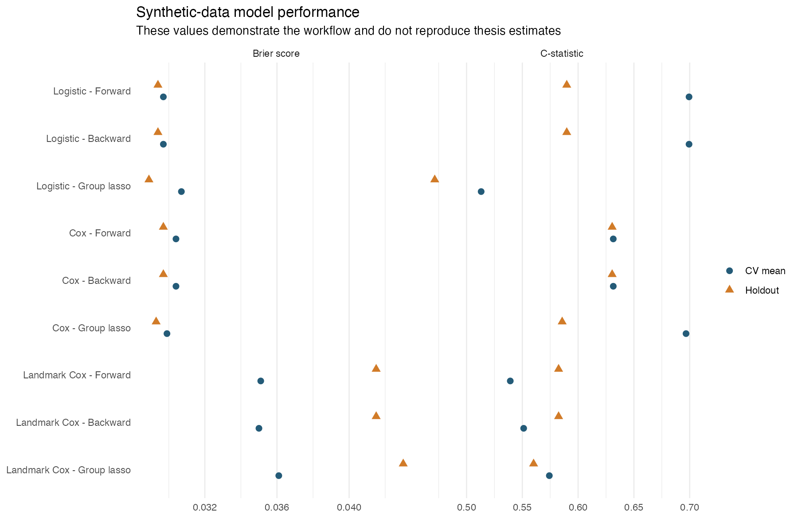
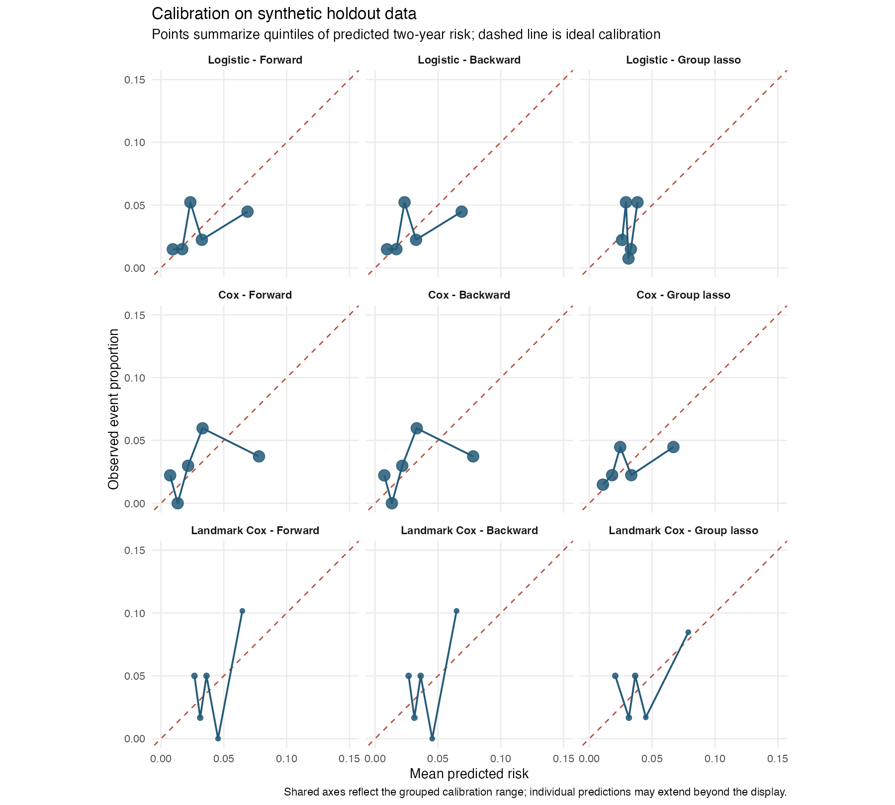

# Two-Year Mortality or Transplant Risk in Cystic Fibrosis

An end-to-end R demonstration of nine prediction-model combinations adapted
from my MSc Statistics thesis:
[*A Critical Review and Comparison of Methods to Predict Mortality in People
with Cystic Fibrosis*](https://dal.scholaris.ca/items/4a88c5fa-3d03-4224-a99b-08bcdabe741c)
(Dalhousie University, 2024).

## What this repository contains

The public pipeline combines three regression frameworks with three variable
selection methods:

| Regression framework | Forward BIC | Backward BIC | Group lasso |
|---|:---:|:---:|:---:|
| Logistic regression | Yes | Yes | Yes |
| Cox proportional hazards | Yes | Yes | Yes |
| Landmark Cox regression | Yes | Yes | Yes |

It constructs overlapping two-year prediction windows, reserves an untouched
10% patient-level holdout set, performs five-fold patient-level cross-validation,
and reports:

- C-statistic;
- calibration slope and intercept;
- Brier score;
- net benefit at a declared probability threshold; and
- grouped calibration and decision-curve figures.


## Data and reproducibility statement

The original Canadian Cystic Fibrosis Registry (CCFR) records are confidential
and are **not included**. The public code generates a new, synthetic longitudinal
dataset from random draws. Its variable types and broad marginal patterns are
informed only by aggregate summaries reported in the thesis (Tables 3.2-3.4).

The synthetic generator is designed to exercise the analysis pipeline. It does
not reconstruct any participant, reproduce the real multivariable distribution,
or reproduce the numerical thesis findings. Every output under `outputs/` is
therefore an illustrative synthetic-data result.

The separate file `results/thesis_holdout_performance.csv` transcribes aggregate
holdout results from thesis Table 4.2 for reference. Those values were calculated
from confidential source data and will not be regenerated by this repository.

## Example synthetic run

The repository includes selected outputs from the default demonstration run
with `CF_N_PATIENTS=1000` and `CF_LASSO_NLAMBDA=30`. This fixed-seed simulation
produced 130 composite events across the complete synthetic cohort; 130 is a
realized outcome count, not a configuration setting.

| Model | Holdout evaluation units | Events | C-statistic | Brier score |
|:---|:---:|:---:|:---:|:---:|
| Logistic - Forward | 671 intervals | 20 | 0.5898 | 0.0294 |
| Logistic - Backward | 671 intervals | 20 | 0.5898 | 0.0294 |
| Logistic - Group lasso | 671 intervals | 20 | 0.4715 | 0.0289 |
| Cox - Forward | 671 intervals | 20 | 0.6305 | 0.0297 |
| Cox - Backward | 671 intervals | 20 | 0.6305 | 0.0297 |
| Cox - Group lasso | 671 intervals | 20 | 0.5857 | 0.0293 |
| Landmark Cox - Forward | 298 landmark records | 13 | 0.5825 | 0.0415 |
| Landmark Cox - Backward | 298 landmark records | 13 | 0.5825 | 0.0415 |
| Landmark Cox - Group lasso | 298 landmark records | 13 | 0.5601 | 0.0430 |

The patient-level split contains 100 holdout patients. Their repeated annual
measurements produce 671 eligible, overlapping two-year prediction intervals
for the logistic and standard Cox models. Landmark evaluation retains 82 of
these patients at one or more eligible landmark ages, producing 298
age-specific landmark records. The two evaluation samples are therefore not
directly interchangeable. Forward and backward selection happened to converge
on identical predictions within each framework in this synthetic run.

Predictive performance in this synthetic demonstration was modest and varied
across validation folds, reflecting the illustrative data-generating process
and the limited number of holdout events. These estimates are intended to
demonstrate the analytical workflow; they should not be interpreted as evidence
of clinical performance or compared numerically with estimates from the
confidential thesis dataset.



The calibration display uses five equal-frequency groups because the holdout
sample contains few events. All nine panels share the same axes, which are
scaled to the grouped calibration range rather than to a few extreme individual
predictions.



The complete aggregate results are in
[`outputs/tables/performance_summary.csv`](outputs/tables/performance_summary.csv).
The [decision-curve figure](outputs/figures/decision_curves.png) is provided as
an exploratory extension and is not treated as a thesis result.

## Results reported in the original thesis

For comparison, the following selected values come from thesis Table 4.2 and
were generated using the confidential CCFR data. They cannot be reproduced by
running this public synthetic-data pipeline.

| Model | Thesis holdout C-statistic | Thesis holdout Brier score |
|:---|:---:|:---:|
| Logistic - Forward | 0.9409 | 0.0237 |
| Logistic - Backward | 0.9409 | 0.0237 |
| Logistic - Group lasso | 0.9338 | 0.0254 |
| Cox - Forward | 0.9390 | 0.0231 |
| Cox - Backward | 0.9390 | 0.0231 |
| Cox - Group lasso | 0.9421 | 0.0245 |
| Landmark Cox - Forward | 0.8777 | 0.0606 |
| Landmark Cox - Backward | 0.8777 | 0.0606 |
| Landmark Cox - Group lasso | 0.8577 | 0.1612 |

Calibration and net-benefit estimates from the same thesis table are retained
in [`results/thesis_holdout_performance.csv`](results/thesis_holdout_performance.csv).

## Analysis design

### Outcome

The binary endpoint is death or lung transplant within two years after a
prediction origin. The synthetic source data contain annual, time-varying
measurements and a coherent age/calendar-time follow-up history.

The standard Cox models use age as the analysis time with start-stop intervals.
The `grpreg` group-lasso Cox implementation uses two-year time-on-study because
that package fits right-censored, rather than counting-process, responses; this
matches the practical implementation used in the thesis code.

### Patient-level separation

All records belonging to a patient remain together in the training, validation,
or holdout partition. The same rule is used for the inner folds that tune group
lasso penalties. This prevents repeated annual records from the same synthetic
patient leaking across folds.

### Landmark analysis

Candidate landmark ages run from 6 through 50 years. At each landmark, the most
recent prior measurement is retained for patients still at risk, and outcomes
are evaluated over the following two years. Landmark ages with fewer than 40
at-risk patients or fewer than five training events are skipped and reported in
`outputs/tables/landmark_training_counts.csv`, so each five-fold tuning split can
contain an event when the synthetic sample permits.

Forward and backward landmark models use a stacked Cox supermodel stratified by
landmark age. In keeping with the thesis, landmark group lasso fits a separate
penalized Cox model at each eligible landmark age.

### Variable selection

- Forward and backward selection minimize BIC. The BIC penalty uses the number
  of independent patients rather than the number of repeated rows.
- Cox candidates that trigger non-convergence or potentially infinite-coefficient
  warnings are excluded. A backward search simplifies an unstable saturated
  model until it reaches a stable candidate before applying the BIC stopping rule.
- Logistic group lasso uses `gglasso`.
- Cox and landmark group lasso use `grpreg`.
- Dummy variables belonging to one categorical predictor share one penalty group.
- Design-matrix columns and scaling values are learned from training data and
  then applied unchanged to validation and holdout data.
  
### Model evaluation

Discrimination was assessed using the area under the ROC curve (reported as
the C-statistic) for the binary two-year outcome, calculated separately within
each patient-level outer cross-validation fold and in the untouched holdout
set. Calibration was assessed using the calibration slope and intercept and
grouped calibration plots, while overall prediction error was summarized using
the Brier score. Decision-curve analysis was included as an exploratory
post-thesis extension.

## Run the project

Use R 4.2 or later. From the repository root:

```r
install.packages(c(
  "broom", "dplyr", "gglasso", "ggplot2", "grpreg", "here", "MASS",
  "pROC", "purrr", "readr", "rlang", "scales", "survival", "tibble", "tidyr"
))

source("main.R")
```

The default run uses 1,000 synthetic patients and evaluates 30 group-lasso
penalty values. These defaults reproduce the configuration used for the
committed illustrative outputs. The number of simulated outcomes is generated
by the event process and is not controlled by `CF_LASSO_NLAMBDA`.

For a larger, slower demonstration run, override the defaults before sourcing
`main.R`:

```r
Sys.setenv(CF_N_PATIENTS = 1800, CF_LASSO_NLAMBDA = 50)
source("main.R")
```

## Repository structure

```text
.
├── main.R
├── R/
│   ├── 00_simulate_data.R
│   ├── 01_prepare_data.R
│   ├── 02_split_data.R
│   ├── 03_model_helpers.R
│   ├── 04_fit_final_models.R
│   ├── 05_evaluate_models.R
│   ├── 06_create_figures.R
│   ├── 99_smoke_checks.R
│   ├── config.R
│   └── utils.R
├── data/
│   ├── data_dictionary.md
│   ├── raw/                 # generated; ignored by Git
│   └── processed/           # generated; ignored by Git
├── outputs/
│   ├── figures/             # selected synthetic demonstration figures
│   ├── tables/              # aggregate synthetic results
│   └── models/              # generated; ignored by Git
└── results/
    └── thesis_holdout_performance.csv
```

## Interpretation

On the original confidential data, the thesis found broadly similar
discrimination for logistic and standard Cox approaches and lower performance
for landmark approaches. See the thesis for the study population, complete
results, assumptions, and limitations.

## Author

Zijin (Janet) Cheng, MSc Statistics
